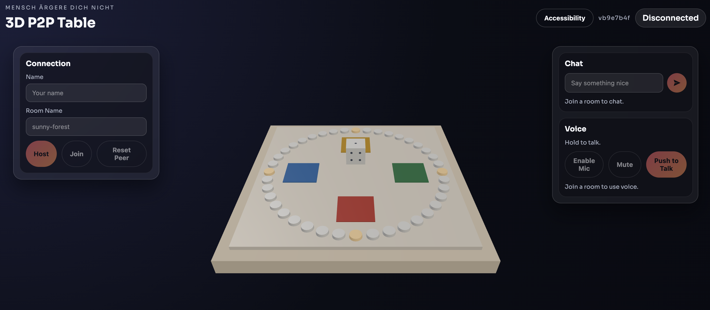

# Don't Be Angry — 3D P2P (React)

React + Three.js version of Mensch ärgere Dich nicht with peer-to-peer multiplayer.



## Run locally

```bash
npm install
npm run dev
```

Open the URL printed by Vite on each device/browser.

## How to play

1. One player clicks **Host** and shares the Room Name.
2. Others click **Join** and enter the same Room Name.
3. Host clicks **Start Game** (or just roll once to auto-start).

## Controls

- **Reset Peer** = leave the game. The remaining players can restart without you.
- Chat/Voice: available on desktop; hidden on mobile view.

## Accessibility

Use the **Accessibility** button in the header to toggle:

- Large text
- High contrast
- Reduce motion

## Notes

- WebRTC works on `localhost` in modern browsers.
- PeerJS uses a public signaling server by default. Configure it in `src/App.jsx`.
